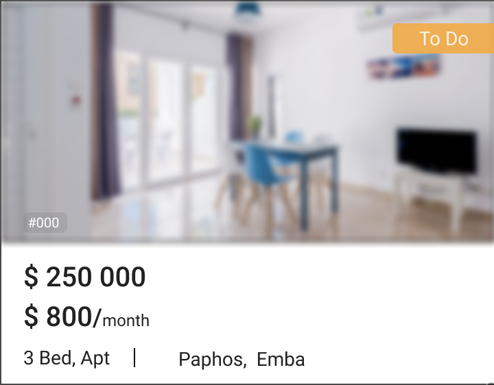

[PUT../provider/{num}/{taskClass}/{idField}]:https://gitlab.4u.house/4u/provider/provider-backend/tree/develop#putprovidernumtaskclassidfield
[Item]:https://gitlab.4u.house/4u/provider/provider-backend/blob/develop/README.md#item
[Note]:https://gitlab.4u.house/4u/provider/provider-backend/blob/develop/README.md#note
[Property]:https://gitlab.4u.house/4u/provider/provider-backend/blob/develop/README.md#property
[Button]:https://gitlab.4u.house/4u/provider/provider-backend/blob/develop/README.md#button
[Screen]:https://gitlab.4u.house/4u/provider/provider-backend/blob/develop/README.md#sreen

# **Provider** service description

- [**Provider** service description](#provider-service-description)
    - [Idea](#idea)
    - [Components](#components)
        - [Item](#item)
        - [Note](#note)
        - [Property](#property)
        - [Button](#button)
    - [Screen](#screen) 
    
## Idea
>>>
Приложение состоит из набора экранов (screen). Каждый экран описывается в виде джейсона, который приходит в ответе на запрос.
Экран содержит список компонент и кнопок.

Сервер покрыт авторизацией.
>>>

## Components

### Item
>>>
Модель данных компоненты - [Item][]

Макет компоненты


#### Conditions
1. Отображение picture
    ```kotlin    
    if (picture = null)
        "key" сдвигать на место "picture"
    ```
2. Цвет, переход на другой экран, редактирование
    ```kotlin
    if (isTransition == true)
        после "value" отображать знак ">"
        при нажатии отправить запрос на получение экрана: к "path" экрана добавить "id" компоненты
    if (isInput == true)
        "key" and "value" отображать ярким цветом
        при нажатии на компоненту в зависимости от typeValue открыть экран ввода данных
        по нажатию на кнопку сохранения на экране ввода данных отправить PUT запрос на редактирование: к "path" экрана добавить "/id" компоненты
        //зависимость экрана от typeValue и параметры запроса смотри в таблице ниже
    else
        "key" and "value" отображать серым цветом
    ```
**Ссылка на PUT запрос - [PUT../provider/{num}/{taskClass}/{idField}][]**

5. Зависимость отображения "value" от поля "typeValue" и открытие доп. экрана смотри в таблице ниже

typeValue | отображение "value"         | экран для ввода | передаваемые параметры в запросе
--------- | --------------------------- | --------------- | ---
switch    |  | -               | value = value, введенное пользователем
date      | 01.01.2019                  |  | value = value, введенное пользователем
money     | значение делить на 100. Перед запятой начиная с конца каждые 3 знака отделять пробелом<br> ex: 1 354 987.76 |  | value = value, введенное пользователем
photo     | -                           |  | в теле запроса передать параметр `img: file`, имя файла = `id компоненты`
>>>

### Note
>>>
Модель данных компоненты - [Note][]

Макет компоненты


#### Conditions
Цвет фона для комментария и цвет текста зависят от поля `color`
>>>

### Property
>>>
Модель данных компоненты - [Property][]

Макет компоненты

example | template
------- | --
 | 

#### Conditions
1. Цвет подложки статуса зависит от поля `statusColor` 
1. if (`picture = null`), выводить сообщение: "Here will be your property"
1. if (`costRent = null`), не отображать строку с данными по аренде
1. if (`costSale = null`), не отображать строку с данными по продаже
1. Поля `costRent` и `costSale` отображать в денежном формате
1. При нажатии отправить запрос на получение экрана: к "path" экрана добавить "id" компоненты
>>>

### Button
>>>
Модель данных компоненты - [Button][]

Макет компоненты


#### Conditions
1. Кнопка доступна для нажатия при `isAble == true`, иначе отображается недоступной 
1. При нажатии кнопки отправить PUT запрос - [PUT../provider/{num}/{taskClass}/{idField}][]: к "path" экрана добавить "/id" компоненты. В запросе отправить "value" компоненты
>>>

## Screen
>>>
Модель данных экрана - [Screen][]

Макет экрана


### Conditions
1. У каждого экрана в заголовке (левее "key") отображается кнопка возврата ">". По нажатию на нее:
    - У "path" экрана убрать последний параметр и запросить новый экран (возврат на предущий)
    - В полученном экране в массиве `components` найти объект с `id == последний параметр path` и поставить на нее фокус.
1. Порядок отображения компонент соответствует порядку в списке "components"
>>>